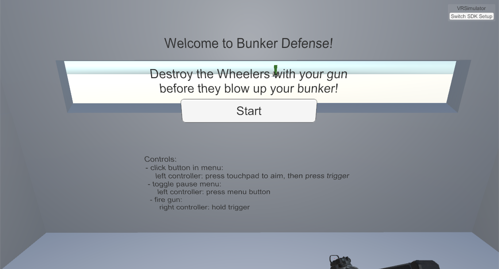

# BunkerDefense
Basic shooter for SteamVR - Destroy the Wheelers with your gun before they blow up your bunker!

## Usage

These instructions will get you a release of the project up and running on your local machine, so you can use it.

### Prerequisites

- Windows
    - 64-bit or 32-bit version
- [SteamVR](https://store.steampowered.com/app/250820/SteamVR/) - The ultimate tool for experiencing VR content on the hardware of your choice
    * you also need a compatible headset

### Getting Started

1. download the [latest release](../../releases/latest)
    - 32-bit: `BunkerDefense-win_x86-<version>.zip`
    - 64-bit: `BunkerDefense-win_x86_64-<version>.zip`
1. unzip the archive
1. run `BunkerDefense.exe`

### How to Play

1. look around and find the menu
1. read the instructions and controls
1. press `Start` on the menu

### Troubleshooting

#### The pointer on the left controller doesn't work / is stuck to the ground

Restarting the game should fix this. Next time, make sue the controllers are turned on before starting the game.

#### The VR headset doesn't show the game, even though the game window is open and running on the monitor

In this situation at the top right corner of the game window above the button `Switch SDK Setup` it should say `VRSimulator`. This means SteamVR couldn't be initialized and the game had to fall back to the VR Simulator, which is only useful for development purposes. Make sure SteamVR is set up properly and then restart the game.

#### The Switch SDK Setup Menu doesn't always react to clicks

Due to a limitation of VRTK, the menu doesn't work properly when time is frozen, i.e. while the main menu is open. To switch between the VR Simulator and SteamVR, you will need to connect or disconnect the VR headset and then restart the game. If SteamVR is ready upon starting the game, the game will choose SteamVR, otherwise it will fall back to the VR Simulator.

#### Neither the character, nor the controllers can be moved, only looking around works

In this situation at the top right corner of the game window above the button `Switch SDK Setup` it should say `VRSimulator`. This means you are using the VR Simulator, which is only useful for development purposes. Instead of using the VR Simulator with mouse and keyboard, you need to get SteamVR and connect a compatible headset and then restart the game.

## Development

These instructions will get you a copy of the project up and running on your local machine for development and testing purposes.

### Prerequisites

- [Unity](https://unity3d.com/get-unity/download) - Real-time development platform
- [SteamVR](https://store.steampowered.com/app/250820/SteamVR/) - The ultimate tool for experiencing VR content on the hardware of your choice
    * you also need a compatible headset

### Getting Started

1. clone this repo
    - to skip steps 2 and 3, use `git clone --recurse-submodules`
1. open repo root folder in terminal
1. download all submodules using `git submodule update --init --recursive`
1. open repo root folder with Unity
1. open scene `Assets/Scenes/Main`

### Relevant Documentation
- VRTK 3.3.0
    - [git repo](https://github.com/ExtendRealityLtd/VRTK/tree/3.3.0)
    - [docs](https://vrtoolkit.readme.io/v3.3.0)
        - [Instructions for using the VR Simulator](https://vrtoolkit.readme.io/docs/getting-started#section-vr-simulator)
            - ⚠️ the simulator doesn't support movement of body or controllers while time is frozen, i.e. while the main menu is open; also, the menu for the SDK Setup Switcher doesn't work while time is frozen ⚠️
    - [tutorial videos](https://www.youtube.com/channel/UCWRk-LEMUNoZxUmY1wO7DBQ/search?query=vrtk+v3)

## Built With

### Libraries

- [VRTK 3.3.0](https://github.com/ExtendRealityLtd/VRTK/tree/3.3.0) - A productive VR Toolkit for rapidly building VR solutions in Unity3d
- [UnityTimer](https://github.com/akbiggs/UnityTimer) - Powerful and convenient library for running actions after a delay in Unity3D

### Guides

- [How to Git with Unity](https://thoughtbot.com/blog/how-to-git-with-unity)
    - `.gitattributes` taken from the [VRTK git repo](https://github.com/ExtendRealityLtd/VRTK/blob/master/.gitattributes)
- [VR in Unity: A Beginner's Guide (using VRTK)](https://learn.unity.com/project/vr-in-unity-a-beginner-s-guide)
    - we use VRTK 3.3.0 instead

## Authors

- **Wladimir Fedorow** - *Models and Explosion* - [Bljadt](https://github.com/Bljadt)
- **Robin Hartmann** - *Organization, Repository Setup and Programming* - [robin-hartmann](https://github.com/robin-hartmann)
- **Roby Jeitz** - *Models and Menu* - [RobyJeitz](https://github.com/RobyJeitz)
- **Ali Karimi** - *Research of VR essentials* - [alibk95](https://github.com/alibk95)

## License

This project is licensed under the MIT License - see the [LICENSE](LICENSE) file for details

## Acknowledgments

- Special thanks to [Wladimir](https://github.com/Bljadt), [Roby](https://github.com/RobyJeitz) and [Ali](https://github.com/alibk95) for letting me publish this project
